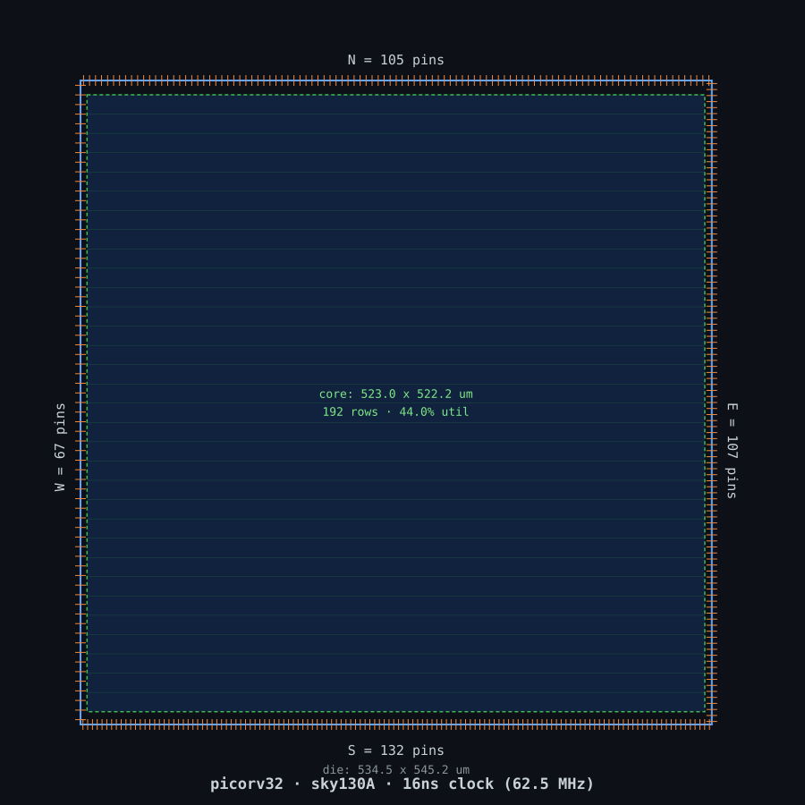
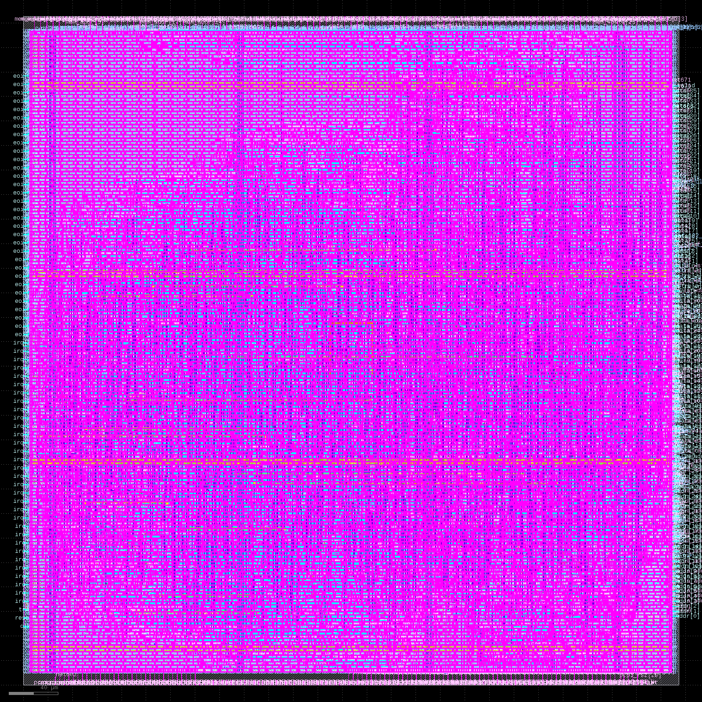
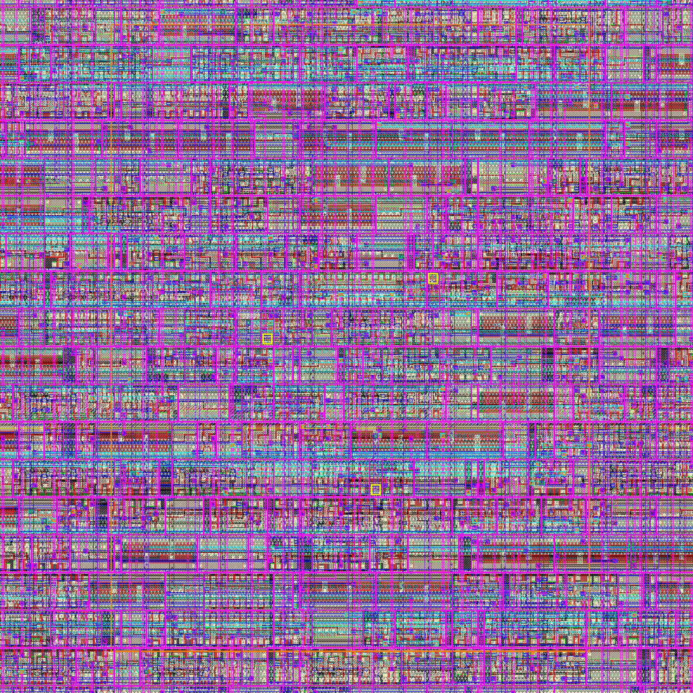

# picorv32 — sky130A RTL-to-GDSII


A complete, clean-signoff RTL-to-GDSII implementation of [YosysHQ's PicoRV32](https://github.com/YosysHQ/picorv32)
(a small RV32I core) on the SkyWater **sky130A** open PDK, driven through
**OpenLane 2.3.10** — not via the stock `openlane` CLI, but through a custom
Python driver that calls the `Step` API directly, one PnR step at a time, so
each stage's decisions (synthesis strategy, floorplan sizing, pin
assignment) could be measured and chosen deliberately instead of accepted as
flow defaults.

<p align="center">
  
  
</p>
<p align="center"><sub>Left: floorplan (die 534.5 × 545.2 µm, 192 core rows, 411 pins split N/S/E/W by actual bit-count). Right: the real signoff GDS, rendered with KLayout.</sub></p>

---

## Results

| | |
|---|---|
| **Clock** | 16 ns period → **62.5 MHz** |
| **Cells** | 17,516 (post-fill) |
| **Die / core area** | 291,404 µm² / 273,142 µm² |
| **Utilization** | 44.0% |
| **Setup slack** (signoff, worst corner) | **+5.632 ns** |
| **Hold slack** (signoff, worst corner) | **+0.256 ns** |
| **Routing DRC** | 0 errors |
| **Magic DRC** | 0 violations |
| **KLayout DRC** | 0 violations |
| **LVS** | clean match (Netgen) |
| **I/O pins** | 411 (N=105, S=132, E=107, W=67) |

Full metrics: [`results/metrics.json`](results/metrics.json) / [`results/metrics.csv`](results/metrics.csv).
Full narrative — every command run, every decision and why, in flow order: **[`docs/custom_flow_log.md`](docs/custom_flow_log.md)**.

<p align="center">
  
</p>
<p align="center"><sub>Detail crop of the core — standard cell rows, local interconnect (magenta), and metal routing (blue/green/cyan). The small yellow-outlined cells are inserted antenna diodes.</sub></p>

---

## What makes this more than "ran the default flow"

- **Verified the port list against the RTL, not assumed it.** The first
  `pin_order.cfg` missed `trace_valid`/`trace_data[35:0]` — unconditionally
  declared ports that only *look* trace-gated at a glance. Caught by a failed
  IO-placement run, fixed by re-reading the RTL port-by-port.
- **Swept 18 synthesis configurations** (`SYNTH_STRATEGY` × `SYNTH_HIERARCHY_MODE`)
  instead of accepting Yosys's default. The winner (`AREA 3`/`flatten`) traded
  +72% cell count for +1.07 ns of setup margin — a real, deliberate,
  measured trade, not a guess.
- **Derived `CLOCK_PERIOD` from a real baseline STA run** (20 ns → 16 ns),
  rather than picking a round number.
- **Computed an absolute-sizing floorplan fallback** before attempting
  relative sizing, so the flow degrades gracefully instead of dying on a
  utilization error (it wasn't needed here, but was ready).
- **Survived two real infrastructure failures mid-run**: the host disk
  filled to zero (crashing the first, stock-CLI baseline attempt mid-CTS),
  and a live `nix-shell` environment got partially garbage-collected out from
  under the running process. Both are written up in the log, including how
  the driver's checkpoint/resume mechanism avoided re-running the 6-minute
  synthesis sweep.

## Repository layout

```
.
├── src/picorv32.v, impl.sdc, signoff.sdc   # RTL + SDC (picorv32.v: ISC, see NOTICE)
├── config.yaml                              # stock OpenLane config (reference / CLI baseline)
├── pin_order.cfg                            # custom pin-side assignment (see docs log, §5)
├── flow/
│   ├── run_custom_flow.py                   # the driver — Step API, no Flow/CLI involved
│   ├── config_custom.yaml                   # CLOCK_PERIOD=16, FP_CORE_UTIL=40, etc.
│   └── run.sh                               # launcher (uses local env if present, else nix-shell)
├── docs/
│   ├── custom_flow_log.md                   # full step-by-step log: commands, decisions, why
│   └── images/                              # the renders on this page
└── results/                                 # curated signoff outputs (see below)
    ├── metrics.json, metrics.csv
    ├── gds/, def/, lef/, lib/, nl/, pnl/, sdc/, spef/, spice/, vh/
```

`results/` is a curated subset of the full run, not the whole 1.2 GB run
directory: the canonical GDS/DEF/LEF/netlists/timing libs/SDC, plus one
representative-corner SPEF (`nom`) rather than all three. Regenerate the full
run — every one of the 76 individual step directories, the full 18-way
synthesis sweep, per-step logs — with the driver below.

## Reproducing this

Requires [OpenLane 2.3.10](https://openlane2.readthedocs.io/) (Nix-based
install) and the sky130A PDK via [Volare](https://github.com/efabless/volare).

```bash
cd flow
./run.sh                     # full run: lint -> synth sweep -> floorplan -> ... -> GDS + signoff
./run.sh --list               # print the 76-step plan without running anything
./run.sh --sweep-only          # just the synthesis strategy sweep
./run.sh --resume-from 44      # re-enter mid-flow from a saved checkpoint (see docs log, §6)
```

The driver checkpoints state after every step (`runs/<tag>/custom_flow_state/`),
so a crash — disk, environment, anything — costs you the steps since the last
checkpoint, not the whole run.

## License & attribution

- **This repository's own work** (`flow/`, `config.yaml`, `pin_order.cfg`,
  `docs/`) — MIT, see [`LICENSE`](LICENSE).
- **`src/picorv32.v`** — third-party code, ISC license, Copyright (C) 2015
  Claire Xenia Wolf. Unmodified from [YosysHQ/picorv32](https://github.com/YosysHQ/picorv32).
  See [`NOTICE`](NOTICE).
- **`results/`** — physical-design views derived from the above RTL against
  the [SkyWater sky130A PDK](https://github.com/google/skywater-pdk) (their
  own license applies to the standard-cell views they're built against).
